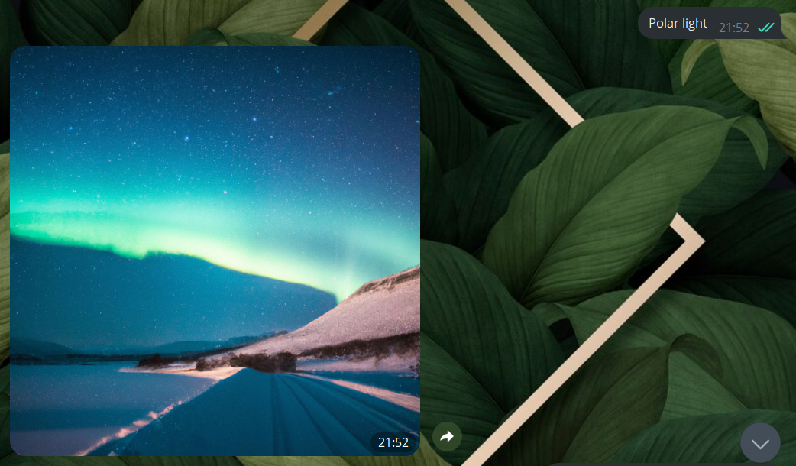

# Generate images - Telegram Bot

This is a Telegram bot for generating photos. It uses the DALL-E 2 artificial intelligence model.

<p align="center">
   
   
   
   
   
</p>

## Installation

You can use requirements.txt file:

```bash
pip install -r requirements.txt
```
## Usage

The bot is very easy to use, you just need to write a request in the chat and the bot will generate an image for you.
You can write requests in both English and Ukrainian. It understands both languages equally well thanks to the translate library.

<p align="center">
      
</p>

## License

[MIT](https://choosealicense.com/licenses/mit/)
